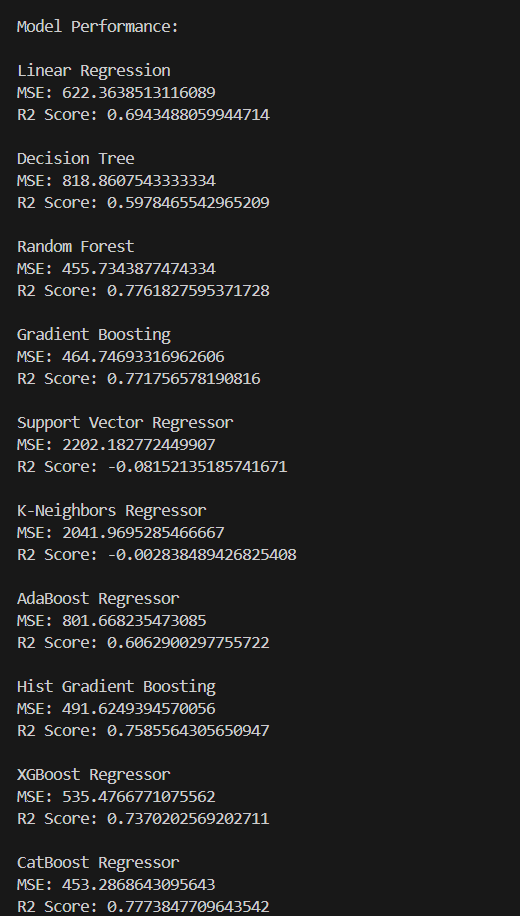

# Fuel Cell Performance Analysis

## Overview
This project analyzes fuel cell performance data using various regression models. The dataset is split based on roll number logic, and model performance is evaluated with metrics like Mean Squared Error (MSE) and R² Score.

## Dataset
The dataset `Fuel_cell_performance_data-Full.csv` should be placed in the `data/` directory.

## Features
- Roll number-based target column selection.
- Data preprocessing to handle missing values.
- Multiple regression models:
  - Linear Regression
  - Decision Tree
  - Random Forest
  - Gradient Boosting
  - Support Vector Regressor
  - K-Neighbors Regressor
  - AdaBoost Regressor
  - Hist Gradient Boosting Regressor
  - XGBoost Regressor
  - CatBoost Regressor

## Usage
1. Clone the repository:
   ```bash
   git clone https://github.com/your-username/fuel-cell-performance-analysis.git
   ```
2. Install dependencies:
   ```bash
   pip install -r requirements.txt
   ```
3. Run the analysis script:
   ```bash
   python src/fuel_cell_analysis.py
   ```

## Results
The results are displayed in the console after executing the script.



## Dependencies
- pandas
- scikit-learn
- xgboost
- catboost

## License
This project is licensed under the MIT License.
